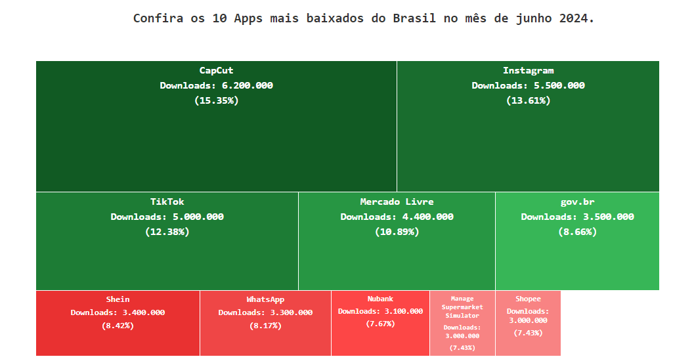

## TreeMap dos 10 Apps Mais Baixados do Brasil

Essa aplicação exibe um TreeMap dos 10 aplicativos mais baixados do Brasil no mês de junho de 2024.<br> 
O TreeMap é uma visualização gráfica que representa dados hierárquicos usando retângulos coloridos.<br> 
Cada retângulo representa um aplicativo e seu tamanho é proporcional à quantidade de downloads.<br>
Foi desenvolvida uma api especialmente para essa aplicação, utilizando o Mock Servers do Postman, onde os dados são baseados nas informações do site [TecMundo](https://www.tecmundo.com.br/internet/286659-10-apps-baixados-brasil-mes-junho-ranking.htm).<br>
A aplicação é responsiva, garantindo boa visualização em dispositivos móveis e desktops.


### Tecnologias Utilizadas

* HTML - [Documentação do HTML](https://developer.mozilla.org/pt-BR/docs/Web/HTML)
* CSS Grid- [Documentação do CSS Grid](https://www.origamid.com/projetos/css-grid-layout-guia-completo/)
* JavaScript- [Documentação do JavaScript](https://developer.mozilla.org/pt-BR/docs/Web/JavaScript)
* Postman - [Site oficial do Postman](https://www.postman.com/)


### Configurar e executar a aplicação

Para configurar e executar a aplicação localmente, siga os passos abaixo:

1. Clone o Repositório: 

 Abra um terminal e execute o comando abaixo para clonar o repositório:

```bash
https://github.com/anapaulaguimaraes/TreeMap-Apps-Mais-Baixados.git
```

2. Acesse a Aplicação:

```bash
Abra um navegador e acesse o arquivo index.html diretamente no navegador ou através de um servidor local se configurado.
```

#### Veja como ficou o projeto:


### TreeMap dos 10 Apps Mais Baixados do Brasil




